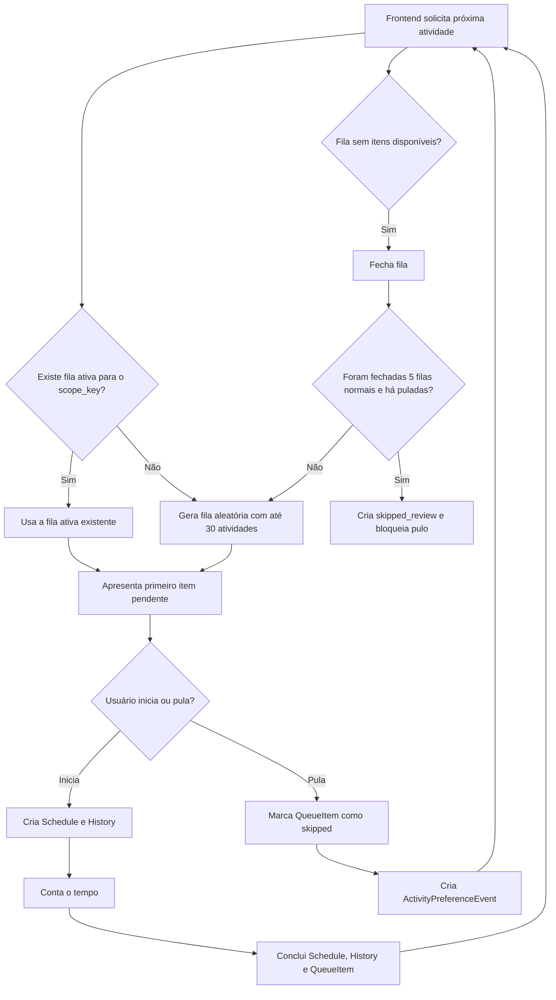
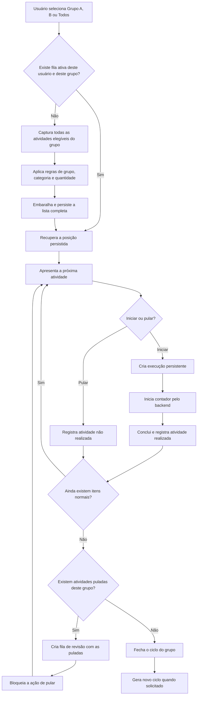

# Análise do backend

**Conclusão geral:** o backend atende parcialmente ao fluxo, mas **ainda não implementa corretamente a regra principal de filas persistentes fechadas e independentes por grupo**.

A base técnica está bem encaminhada: existem filas persistidas, itens ordenados, atividade apresentada, início, conclusão, histórico, atividade pulada e restauração do contador. Entretanto, há divergências relevantes entre o fluxo desejado e o comportamento atual.

## Resultado por requisito

| Requisito                                                 | Situação                         |
| --------------------------------------------------------- | -------------------------------- |
| Criar fila persistente                                    | Atendido                         |
| Fechar a lista com todas as atividades                    | Não atendido integralmente       |
| Manter fila independente por grupo                        | Não atendido                     |
| Grupo “Todos” listar todas                                | Parcialmente atendido            |
| Iniciar atividade                                         | Atendido                         |
| Pular atividade                                           | Atendido                         |
| Registrar atividade executada                             | Parcialmente atendido            |
| Registrar atividade não realizada                         | Parcialmente atendido            |
| Contador persistente                                      | Atendido                         |
| Mostrar próxima após conclusão                            | Atendido por consulta posterior  |
| Reprocessar puladas ao fim da fila                        | Não atendido conforme solicitado |
| Bloquear pulo na revisão                                  | Atendido                         |
| Inserir novas atividades aleatoriamente na fila existente | Não atendido                     |
| Respeitar limites das categorias                          | Atendido parcialmente            |
| Respeitar regras de tempo dos grupos                      | Não identificado                 |
| Evitar concentração em um mesmo jogo                      | Parcialmente atendido            |

---

# 1. Fila persistente

O backend possui os modelos:

* `ActivityQueue`
* `ActivityQueueItem`

Arquivo:

```text
apps/pomodoro/models.py
```

A fila registra:

* grupo;
* escopo do usuário;
* modo;
* tamanho;
* quantidade consumida;
* estado ativo ou fechado;
* posição persistida de cada atividade.

Isso atende corretamente ao conceito de não sortear novamente a cada atualização do frontend.

O método responsável é:

```text
apps/pomodoro/services/activity_queue.py
```

```python
get_or_create_active_queue()
```

A chamada repetida de `GET /api/activities/next/` devolve o mesmo item enquanto ele não for iniciado ou pulado.

Esse comportamento também está coberto no teste:

```text
apps/pomodoro/tests.py
```

```python
test_next_returns_persisted_queue_item_and_repeats_until_consumed
```

**Situação: atendido.**

---

# 2. Uma fila para cada grupo

O fluxo solicitado exige algo semelhante a:

```text
Grupo A
  └── Fila ativa própria

Grupo B
  └── Fila ativa própria

Grupo Todos
  └── Fila ativa própria
```

O backend atual possui esta constraint:

```python
models.UniqueConstraint(
    fields=['scope_key'],
    condition=Q(state='active'),
    name='unique_active_queue_per_scope',
)
```

Arquivo:

```text
apps/pomodoro/models.py
```

Isso significa que pode existir apenas:

```text
1 fila ativa por scope_key
```

e não:

```text
1 fila ativa por scope_key + grupo
```

Além disso, a busca da fila ativa utiliza:

```python
.filter(
    scope_key=scope_key,
    state=ActivityQueue.STATE_ACTIVE,
)
```

Ela não utiliza o grupo selecionado:

```python
group=selected_group
```

Consequência prática:

1. usuário abre o Grupo A;
2. backend cria a fila do Grupo A;
3. usuário troca para o Grupo B;
4. backend encontra a fila ativa existente do Grupo A;
5. backend continua devolvendo itens do Grupo A.

Portanto, o campo `group` existe na fila, mas não participa corretamente da identificação da fila ativa.

**Situação: não atendido.**

A chave lógica deveria ser algo próximo de:

```text
scope_key + group
```

Para “Todos”, seria necessário definir uma representação consistente, como:

```text
group = grupo default
```

ou um campo explícito de escopo global.

A constraint deveria refletir essa composição, e os métodos de busca também.

---

# 3. Grupo “Todos”

Atualmente, quando o grupo selecionado é default, o backend não aplica filtro de grupo:

```python
if selected_group and not selected_group.is_default:
    queryset = queryset.filter(category__group=selected_group)
```

Portanto, “Todos” representa:

```text
todas as atividades de todos os grupos
```

Isso parece compatível com o objetivo informado.

Entretanto, há dois problemas:

1. se nenhuma identificação de grupo for enviada, o comportamento também é global;
2. devido à fila única por `scope_key`, a fila global pode conflitar com uma fila específica já existente.

**Situação: conceito atendido, persistência por grupo não atendida.**

---

# 4. A lista não contém necessariamente todas as atividades

Na geração da fila normal existe um limite fixo:

```python
activities = ordered_activities[:30] if len(ordered_activities) > 30 else ordered_activities
```

Arquivo:

```text
apps/pomodoro/services/activity_queue.py
```

Isso significa que, havendo 80 atividades elegíveis, somente 30 entram na fila.

O requisito informado é:

> fila com a lista de todas as atividades dele

Portanto, esse corte contradiz diretamente o fluxo desejado.

Além disso, as atividades já concluídas no dia são excluídas:

```python
completed_today = HistoryActivities.today_completed_ids(today)
queryset = queryset.exclude(id__in=completed_today)
```

Essa exclusão pode estar correta para evitar repetição, mas precisa ser tratada separadamente da ideia de “lista completa”. A lista completa provavelmente deve signific:

```text
todas as atividades elegíveis naquele ciclo
```

e não necessariamente todas as atividades cadastradas sem considerar limites.

**Situação: não atendido integralmente.**

---

# 5. Sorteio e ordem aleatória

O backend gera uma ordem aleatória persistida:

```python
score = rng.random() ** (1.0 / weight)
```

As atividades são gravadas com posição:

```python
ActivityQueueItem(
    queue=queue,
    activity=activity,
    position=index + 1,
)
```

Depois disso, a ordem permanece fixa durante o consumo da fila.

Esse é um comportamento adequado para o propósito do projeto:

> deixar o acaso listar as atividades que serão realizadas no tempo livre.

Existe ainda prioridade para atividade premium e um sistema de peso baseado em eventos anteriores.

Contudo, o algoritmo aumenta a chance de atividades já concluídas como favoritas:

```python
EVENT_FAVORITE_COMPLETED
```

Isso pode produzir justamente o efeito que o projeto pretende evitar: atividades que o usuário costuma executar podem aparecer mais frequentemente.

Por exemplo:

```text
BDO farme
Path of Exile 2
```

podem ganhar peso progressivo e dominar ciclos futuros.

O algoritmo precisa equilibrar:

* acaso;
* variedade;
* limite por categoria;
* intervalo desde a última execução;
* repetição consecutiva;
* quantidade máxima por ciclo.

Hoje ele privilegia atividades já executadas, em vez de aplicar uma regra forte de diversidade.

**Situação: parcialmente atendido.**

---

# 6. Iniciar atividade

O endpoint implementado é:

```text
POST /api/activities/{activity_id}/start/
```

Com:

```json
{
  "queue_item_id": 123
}
```

O serviço:

```text
apps/pomodoro/services/activity_execution.py
```

faz corretamente:

* validação da relação entre item e atividade;
* bloqueio de item consumido;
* bloqueio de outra atividade em execução;
* idempotência;
* gravação da execução;
* associação ao item da fila;
* cálculo do término esperado;
* criação do histórico.

Também existe constraint para uma execução aberta por escopo:

```python
UniqueConstraint(
    fields=['scope_key'],
    condition=Q(state__in=['preparing', 'running']) & ~Q(scope_key=''),
)
```

**Situação: atendido.**

---

# 7. Registro da atividade realizada

Ao iniciar uma atividade, o backend já cria o histórico:

```python
History.objects.create(
    activity=activity,
    schedule=schedule,
    start_time=now,
)
```

Quando o tempo termina, o histórico é atualizado com:

* horário final;
* duração;
* conclusão.

Portanto, a tabela `History` representa as atividades realizadas.

Porém, ela é criada no início, antes da conclusão. Isso significa que uma atividade iniciada e nunca concluída também possui registro em `History`, com:

```text
end_time = null
duration = null
```

Isso não é necessariamente incorreto, mas a tabela passa a significar:

```text
atividade iniciada
```

e não exclusivamente:

```text
atividade feita/concluída
```

Para relatórios, é obrigatório filtrar:

```text
end_time IS NOT NULL
```

ou verificar o estado do `Schedule`.

**Situação: parcialmente atendido.**

---

# 8. Registro de atividades puladas

Ao pular, o backend:

1. altera o item para `skipped`;
2. registra `skipped_at`;
3. cria um `ActivityPreferenceEvent` do tipo `skipped`.

```python
item.state = ActivityQueueItem.STATE_SKIPPED
item.skipped_at = now
```

```python
ActivityPreferenceEvent.objects.get_or_create(
    activity=item.activity,
    queue=queue,
    queue_item=item,
    event_type=ActivityPreferenceEvent.EVENT_SKIPPED,
)
```

Não existe uma tabela específica denominada algo como:

```text
SkippedActivity
UnperformedActivity
AtividadeNaoRealizada
```

Mas a informação está persistida em:

```text
ActivityQueueItem
ActivityPreferenceEvent
```

Do ponto de vista técnico, isso pode ser suficiente, desde que o domínio considere `ActivityPreferenceEvent` o registro oficial das não realizadas.

O problema é que o evento pode ser apagado em cascata quando a fila ou item forem apagados:

```python
on_delete=models.CASCADE
```

Para histórico permanente, isso é frágil.

**Situação: parcialmente atendido.**

---

# 9. Contagem do tempo

O backend persiste:

```text
requested_at
starts_at
expected_end_at
completed_at
```

O tempo não depende apenas do contador local do celular ou desktop.

O método:

```python
reconcile_schedule()
```

verifica:

```python
if schedule.expected_end_at <= timezone.now():
    return complete_schedule(schedule)
```

Assim, ao consultar a execução ativa ou o status, uma execução vencida é concluída.

Isso atende ao comportamento multiplataforma e evita reinício do contador após refresh.

**Situação: atendido com ressalva.**

A ressalva é que não foi identificado um scheduler independente e comprovadamente ativo. Sem frontend consultando o backend, a conclusão poderá permanecer pendente até uma nova chamada de:

* execução ativa;
* status;
* reconciliação;
* conclusão manual.

---

# 10. Próxima atividade depois da conclusão

Quando a atividade é concluída:

* o `Schedule` passa para `completed`;
* o `ActivityQueueItem` passa para `completed`;
* a fila atualiza `consumed_count`.

Na próxima chamada:

```text
GET /api/activities/next/
```

o backend seleciona o próximo item `pending`.

Isso atende ao fluxo, embora a resposta de conclusão não devolva diretamente a próxima atividade. O frontend precisa:

1. concluir/reconciliar;
2. chamar `/activities/next/`.

**Situação: atendido.**

---

# 11. Revisão das atividades puladas

O requisito é:

> quando passar por todas as atividades de um grupo, gerar uma nova lista com atividades puladas e nesse fluxo não deixar pular.

O backend possui um modo:

```text
skipped_review
```

e bloqueia pulo:

```python
if queue.skip_locked:
    raise QueueConflict(
        'skip_locked',
        'Esta pool permite apenas executar atividades puladas.',
    )
```

Essa parte está correta.

Entretanto, a revisão não é criada imediatamente depois que todas as atividades do grupo forem percorridas.

Ela somente ocorre nesta condição:

```python
if pending_skipped and closed_normal_count and closed_normal_count % 5 == 0:
    return ActivityQueue.MODE_SKIPPED_REVIEW, True, next_pool_number
```

Ou seja:

```text
revisão das puladas somente após cada 5 filas normais fechadas
```

Isso é diferente do fluxo solicitado:

```text
fila normal do grupo terminou
→ criar imediatamente fila somente com puladas
→ bloquear novo pulo
```

Além disso, a contabilização de puladas usa apenas `scope_key`, sem separar grupo:

```python
ActivityPreferenceEvent.objects.filter(
    queue__scope_key=scope_key
)
```

Assim, atividades puladas no Grupo A podem contaminar a revisão do Grupo B ou do Grupo Todos.

**Situação: não atendido conforme a regra informada.**

---

# 12. Novas atividades em uma fila já criada

O requisito informa:

> novas atividades ou atividades alteradas podem ser colocadas aleatoriamente na fila persistente fechada.

O backend atual não faz isso.

Depois que a fila é criada, os itens permanecem os mesmos. Uma atividade criada posteriormente somente será considerada quando uma nova fila for gerada.

Para atividades alteradas:

* alteração de nome ou duração aparece porque o item referencia o cadastro atual;
* alteração de grupo não reposiciona o item;
* ativação de atividade não a inclui;
* desativação faz o item ser expirado;
* alteração de categoria não recalcula automaticamente a fila;
* alteração de prioridade não reposiciona o item.

Portanto:

```text
nova atividade → não entra na fila ativa
atividade reativada → não entra na fila ativa
mudança de grupo → item antigo pode permanecer na fila errada
mudança de prioridade → ordem não é recalculada
```

**Situação: não atendido.**

Para implementar isso sem destruir a estabilidade da fila, seria necessário um serviço explícito de reconciliação, por exemplo:

```text
reconcile_active_queues_for_activity(activity)
```

Uma inserção adequada poderia escolher aleatoriamente uma posição entre:

```text
próxima posição ainda não consumida
e
última posição da fila
```

Nunca deveria alterar itens já:

* apresentados;
* iniciados;
* concluídos;
* pulados.

---

# 13. Limites das categorias

O backend utiliza:

```python
Category.max_daily_executions
```

e calcula o número de históricos do dia.

Categorias cujo limite foi atingido são excluídas da seleção.

Isso atende parcialmente à regra de quantidade por categoria.

Há uma decisão importante no comportamento atual: o histórico é criado no momento em que a atividade começa. Portanto, uma atividade iniciada já consome o limite, mesmo que não termine.

Isso é coerente caso a regra seja:

```text
quantidade máxima de inícios por categoria
```

Mas não caso a regra pretendida seja:

```text
quantidade máxima de atividades concluídas por categoria
```

Esse ponto deve ser formalizado na specification.

**Situação: atendido parcialmente.**

---

# 14. Tempo dos grupos

O modelo `Group` contém somente:

```text
name
description
color
is_default
```

Não há campos identificados para:

* tempo máximo do grupo;
* tempo mínimo;
* limite diário;
* janela de execução;
* quantidade máxima;
* intervalo;
* cooldown;
* proporção entre grupos.

Portanto, o backend não demonstra implementar “regra de tempo dos Groups”.

O tempo está localizado em:

```python
Activity.duration
```

E a quantidade em:

```python
Category.max_daily_executions
```

Caso exista uma regra como:

```text
Grupo Jogos: no máximo 2 horas por dia
Grupo Estudos: no mínimo 1 atividade
Grupo Séries: 30 minutos por ciclo
```

ela não está representada no modelo atual.

**Situação: não atendido ou não documentado no código.**

---

# 15. Problema de isolamento do usuário

O `scope_key` é gerado pelo hash do cabeçalho de autorização:

```python
authorization = request.META.get('HTTP_AUTHORIZATION')
return hashlib.sha256(authorization.encode('utf-8')).hexdigest()
```

Como a API utiliza uma API Key, todos os dispositivos que compartilham a mesma chave compartilham:

* fila;
* execução ativa;
* puladas;
* preferências;
* histórico de peso.

Isso pode ser desejável para sincronizar celular e desktop de um único usuário.

Entretanto, se a mesma API Key for usada por mais de um usuário, todos compartilharão o mesmo fluxo.

O domínio ainda não possui um usuário autenticado associado explicitamente a:

* fila;
* execução;
* histórico;
* preferências.

Para uso pessoal, funciona. Para vários usuários, não é suficiente.

---

# Lacunas críticas

## Crítica 1 — fila única para todos os grupos

Arquivos afetados:

```text
apps/pomodoro/models.py
apps/pomodoro/services/activity_queue.py
```

A fila precisa ser identificada por:

```text
scope_key + grupo selecionado
```

Hoje ela é identificada somente por:

```text
scope_key
```

---

## Crítica 2 — limite arbitrário de 30 atividades

Arquivo:

```text
apps/pomodoro/services/activity_queue.py
```

Trecho:

```python
activities = ordered_activities[:30]
```

Isso impede fechar a lista com todas as atividades elegíveis.

---

## Crítica 3 — revisão de puladas ocorre após cinco filas

Arquivo:

```text
apps/pomodoro/services/activity_queue.py
```

A regra atual:

```text
5 filas normais → 1 revisão de puladas
```

A regra desejada:

```text
final da fila do grupo → revisão imediata das puladas daquele grupo
```

---

## Crítica 4 — puladas não são isoladas por grupo

Arquivo:

```text
apps/pomodoro/services/activity_queue.py
```

Os métodos:

```python
_pending_skipped_ids()
_next_mode()
_favorite_weights()
```

consideram o `scope_key`, mas não o grupo.

---

## Crítica 5 — novas atividades não entram na fila ativa

Não há signal ou serviço para reconciliar filas abertas após:

* criação;
* ativação;
* mudança de grupo;
* mudança de categoria;
* mudança de prioridade.

---

## Crítica 6 — regras temporais de grupo ausentes

Arquivo:

```text
apps/pomodoro/models.py
```

O modelo `Group` não possui configuração temporal.

---

## Crítica 7 — ausência de testes para o fluxo principal completo

Os testes atuais verificam:

* persistência do próximo item;
* pulo;
* início;
* conclusão;
* conflito;
* contador;
* categoria.

Não identifiquei testes completos para:

```text
fila A independente da fila B
fila Todos independente
troca de grupo preservando posição
fim da fila gerando revisão imediata
revisão impedindo pulo
puladas isoladas por grupo
inserção de nova atividade em fila ativa
fila contendo mais de 30 atividades
```

---

# Fluxo implementado atualmente



# Fluxo esperado



# Avaliação final

O backend atual possui aproximadamente a seguinte maturidade:

| Área                           | Avaliação    |
| ------------------------------ | ------------ |
| Persistência da fila           | Boa          |
| Persistência da execução       | Boa          |
| Sincronização celular/desktop  | Boa base     |
| Contador por backend           | Boa          |
| Histórico                      | Boa base     |
| Separação por grupo            | Insuficiente |
| Ciclo das puladas              | Divergente   |
| Lista completa                 | Divergente   |
| Inclusão dinâmica              | Ausente      |
| Regras temporais do grupo      | Ausente      |
| Diversidade real de atividades | Parcial      |
| Testes do fluxo integral       | Insuficiente |

**Veredito:** o backend implementa uma primeira versão funcional de fila aleatória persistente, mas **não atende ainda ao fluxo de negócio descrito como versão definitiva**.

As correções prioritárias são:

1. tornar a fila ativa única por usuário e grupo;
2. remover ou parametrizar o limite de 30;
3. criar a revisão de puladas imediatamente ao terminar o ciclo;
4. isolar eventos de pulo e preferências por grupo;
5. reconciliar novas atividades nas filas abertas;
6. modelar as regras temporais dos grupos;
7. criar testes de integração cobrindo o ciclo completo.

Não consegui executar a suíte de testes no ambiente desta análise porque as dependências Python do projeto, incluindo Django, não estão instaladas no runtime. A revisão foi feita diretamente sobre os modelos, serviços, endpoints, migrations e testes presentes no ZIP.
